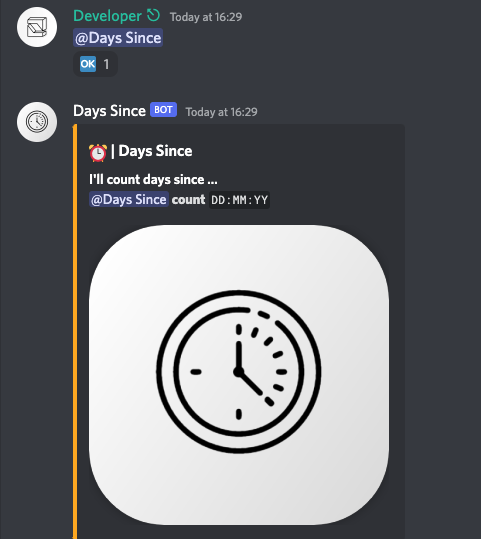
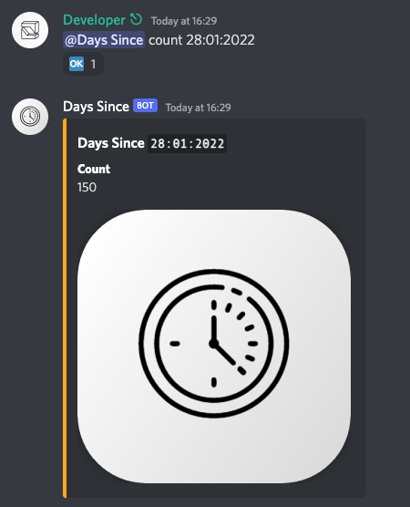

<h2>
    
    <code>Days Since</code> - the Discord Bot
</h2>

A _light-weight_, __open-source__ __Discord__ bot written in `Discord.js` with `TypeScript` that is used to track the number of days since a desired date provided by the user. __Add__ me to your server ~ [link](https://discord.com/api/oauth2/authorize?client_id=990906101644005426&permissions=59456&scope=bot).

### Usage

The usage is fairly simple.

```sh
@Days Since count `DD:MM:YY`
```
\*where `DD:MM:YY` is the date to track.



### Demo

Here we display the number of days that have passed since the date provided by the user - `28:01:2022`.



**I'm open to pull requests and suggestions!**